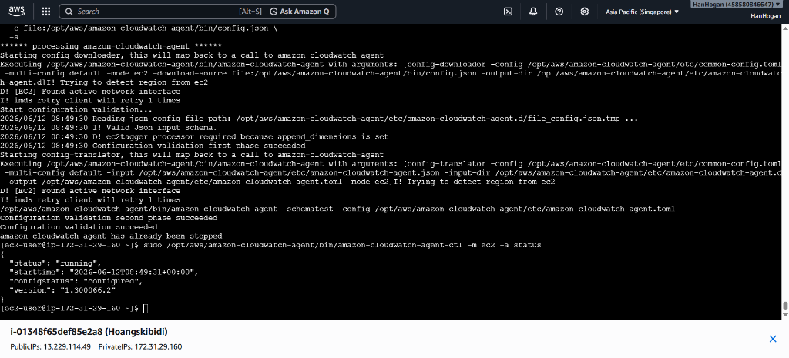
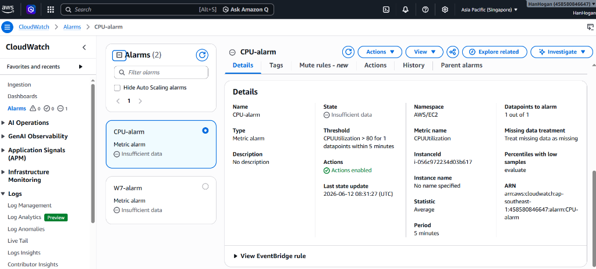

# Báo cáo Minh chứng Thực hành (Lab Evidence) - CloudWatch & SNS

Tài liệu này tổng hợp hình ảnh minh chứng kết quả cài đặt CloudWatch Agent trên máy ảo EC2 và thiết lập cảnh báo CPU Alarm gửi email thông qua Amazon SNS.

---

## 1. Cài đặt CloudWatch Agent trên EC2

Để thu thập các chỉ số chi tiết từ hệ điều hành của máy ảo EC2 (như bộ nhớ RAM, dung lượng đĩa cứng, CPU chi tiết), CloudWatch Agent đã được cài đặt và cấu hình thành công trên máy ảo.

### Thông tin máy ảo EC2:
- **Tên Instance**: `Hoangskibidi`
- **Instance ID**: `i-01348f65def85e28`
- **Địa chỉ Public IP**: `13.229.114.49`
- **Địa chỉ Private IP**: `172.31.29.160`

### Kiểm tra trạng thái hoạt động của Agent:
Trạng thái hoạt động của CloudWatch Agent được kiểm tra bằng lệnh:
```bash
sudo /opt/aws/amazon-cloudwatch-agent/bin/amazon-cloudwatch-agent-ctl -m ec2 -a status
```

### Kết quả đầu ra:
```json
{
  "status": "running",
  "starttime": "2026-06-12T00:49:31+00:00",
  "configstatus": "configured",
  "version": "1.300066.2"
}
```

### Hình ảnh minh chứng:


*(Hình ảnh chứng minh CloudWatch Agent đã được cấu hình thành công và đang ở trạng thái `running` trên máy ảo EC2).*

---

## 2. Cấu hình CPU Alarm gửi Email Alert qua SNS

Thiết lập cảnh báo CloudWatch Alarm giám sát chỉ số sử dụng CPU (`CPUUtilization`) của máy ảo EC2, tự động gửi thông báo qua email khi CPU vượt ngưỡng cấu hình thông qua Amazon SNS (Simple Notification Service).

### Chi tiết cấu hình Alarm:
- **Tên Alarm**: `CPU-alarm`
- **Namespace**: `AWS/EC2`
- **Chỉ số giám sát (Metric name)**: `CPUUtilization`
- **Instance ID**: `i-056c972234d03b617`
- **Ngưỡng cảnh báo (Threshold)**: `CPUUtilization > 80` trong vòng 1 điểm dữ liệu liên tiếp 5 phút (`for 1 datapoints within 5 minutes`).
- **Hành động (Actions)**: Đã kích hoạt (`Actions enabled`), liên kết với một SNS Topic để gửi email.
- **Trạng thái hiện tại**: `Insufficient data` (Đang thu thập dữ liệu ban đầu).
- **Alarm ARN**: `arn:aws:cloudwatch:ap-southeast-1:458580846647:alarm:CPU-alarm`

### Hình ảnh minh chứng:


*(Hình ảnh từ trang chi tiết CloudWatch Console chứng minh cảnh báo `CPU-alarm` đã được tạo thành công với các hành động gửi thông báo được bật).*
