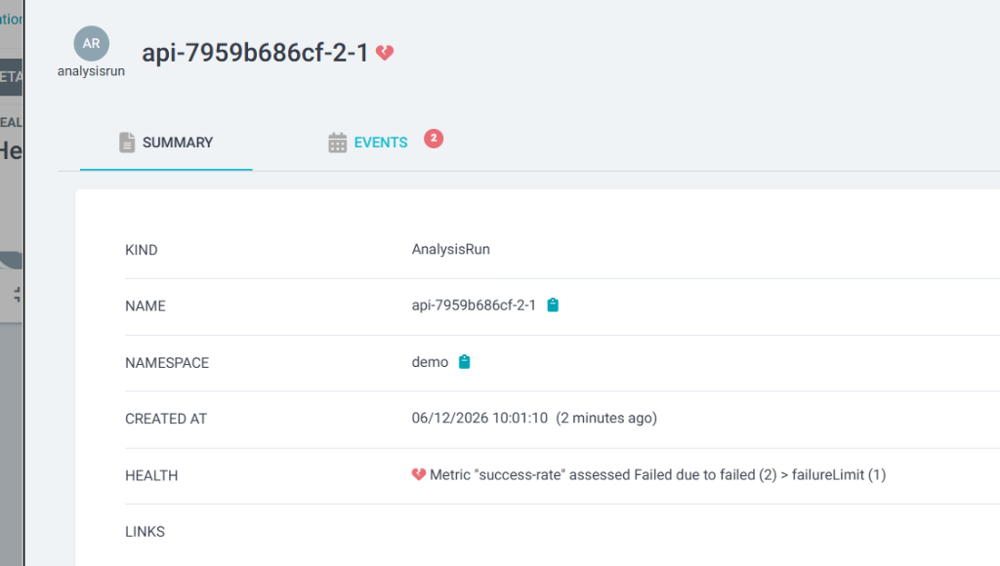

# Hệ thống Triển khai Canary Tự động (Automated Canary Rollout) & Cảnh báo SLO

Hệ thống này tích hợp **ArgoCD**, **Argo Rollouts** và **Prometheus** để tự động giám sát sức khỏe của ứng dụng API service trong suốt quá trình phát hành phiên bản mới (Canary deployment), tự động thúc tiến (promote) khi phiên bản tốt và tự động hủy/quay lui (abort/rollback) khi phát hiện lỗi đột biến.

---

## 1. Giải thích về PromQL Query & Ngưỡng (Metrics & Threshold)

Để tự động đánh giá mức độ an toàn của phiên bản Canary, chúng ta sử dụng `AnalysisTemplate` để truy vấn chỉ số trực tiếp từ Prometheus.

### PromQL Query Sử dụng
```promql
(
  sum(rate(flask_http_request_total{status=~"2.."}[30s]))
  /
  sum(rate(flask_http_request_total[30s]))
) or on() vector(1)
```

**Chi tiết thành phần:**
- `flask_http_request_total{status=~"2.."}`: Tổng số lượng HTTP request trả về mã trạng thái thành công `2xx`.
- `rate(...)[30s]`: Tính tốc độ trung bình của số request trên mỗi giây trong khung thời gian 30 giây gần nhất. Khung giờ ngắn `30s` giúp phát hiện lỗi tức thì, giảm thiểu độ trễ so với `1m` hay `5m`.
- **Phép chia `/`**: Lấy tổng số request thành công chia cho tổng số lượng request nhận được để tính tỷ lệ thành công (Success Rate).
- `or on() vector(1)`: **Cơ chế chống lỗi Idle**. Nếu ứng dụng không có lưu lượng truy cập (no traffic), phép chia sẽ trả về kết quả rỗng (empty), khiến AnalysisRun bị hủy do thiếu dữ liệu. Đoạn mã này dự phòng giá trị mặc định là `1` (100% thành công) khi không có traffic, đảm bảo hệ thống không bị rollback nhầm.

### Ngưỡng Đánh giá (Threshold Config)
Cấu hình chi tiết trong [analysistemplate.yaml](file:///d:/aws/gitops/k8s-api/analysistemplate.yaml):
- **`successCondition: result[0] >= 0.95`**: Tỷ lệ thành công (Success Rate) tối thiểu phải đạt **95%**.
- **`interval: 15s`**: Cứ mỗi 15 giây, hệ thống sẽ gửi một truy vấn tới Prometheus một lần.
- **`count: 4`**: Quá trình phân tích diễn ra trong vòng 4 chu kỳ liên tục (tổng thời gian khảo sát là 1 phút).
- **`failureLimit: 1`**: Giới hạn lỗi tối đa được phép là `1`. Chỉ cần một phép đo đơn lẻ cho kết quả dưới 95% thành công, toàn bộ đợt rollout sẽ lập tức bị hủy bỏ và rollback ngay để đảm bảo an toàn cho khách hàng.

---

## 2. Kiểm thử Tự động Abort & Rollback (Test Case Proof)

Khi triển khai phiên bản bị lỗi (ví dụ: `v6` cấu hình `ERROR_RATE: "0.5"` tạo ra lỗi 50%):
1. Rollout nâng trọng số traffic lên **25%** cho pod mới.
2. `AnalysisRun` được kích hoạt và đo lường chỉ số qua Prometheus.
3. Ở chu kỳ đo thứ 3, Prometheus trả về tỷ lệ thành công thực tế là **`87.2%`** (nhỏ hơn ngưỡng an toàn `95%` tối thiểu).
4. Argo Rollouts ngay lập tức đánh dấu đợt cập nhật là **`Failed`**, chuyển trạng thái Rollout sang **`Degraded`**, tắt hoàn toàn pod phiên bản `v6` lỗi và chuyển toàn bộ 100% traffic trở lại phiên bản ổn định cũ (`v5`) thành công chỉ trong vài giây.

### Hình ảnh Chứng minh từ Giao diện ArgoCD

Dưới đây là hình ảnh thực tế ghi nhận đợt cập nhật Canary tự động rollback do thất bại trong kiểm tra Metric `success-rate`:


